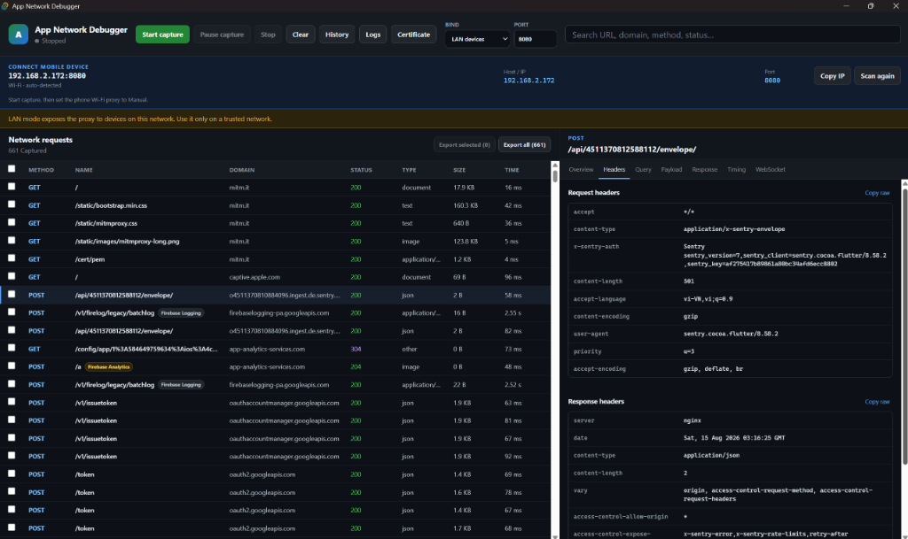
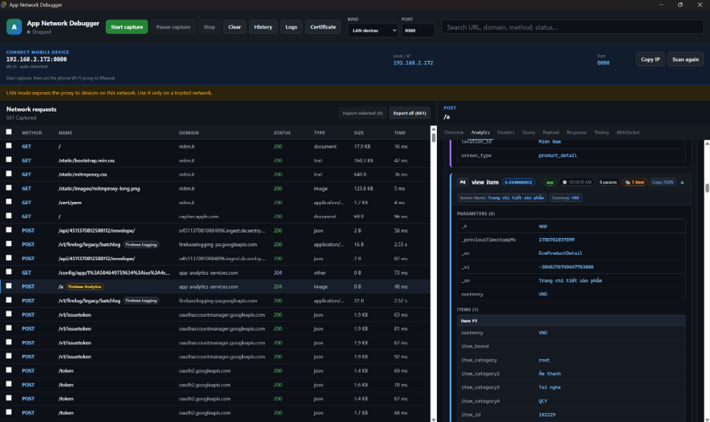
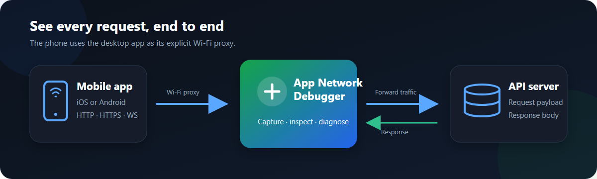
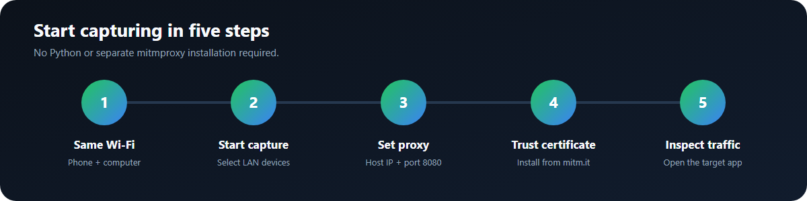

<div align="center">


# App Network Debugger

**Inspect HTTP, HTTPS, and WebSocket traffic from mobile devices with native Firebase Analytics decoding.**

<p align="center">
  <a href="https://github.com/hdz1210/Debug-Mobile/releases/tag/v0.1.6">
    
  </a>
  
  
  
</p>

<p align="center">
  <a href="https://github.com/hdz1210/Debug-Mobile/releases/download/v0.1.6/App-Network-Debugger_0.1.6_windows-x64-setup.exe">
    
  </a>
</p>

---



</div>

## Key Features

| ⚡ **Smart Analytics Inspector** | 📱 **Zero-Config Mobile Proxy** |
| :--- | :--- |
| • **Firebase Native Protobuf Decoding**:<br>&nbsp;&nbsp;Automatically parses binary analytics payloads into human-readable events.<br><br>• **E-Commerce & Items Breakdown**:<br>&nbsp;&nbsp;Inspect `view_item`, `add_to_cart`, `begin_checkout` with nested product items, SKU, price, and category.<br><br>• **Hero Parameter Chips**:<br>&nbsp;&nbsp;Key metadata (`Screen`, `Category`, `Location`, `Currency`, `Value`) spotlighted at a glance.<br><br>• **Real-time Event Search**:<br>&nbsp;&nbsp;Filter events instantly by name or parameter value. | • **Auto IP Detection**:<br>&nbsp;&nbsp;Automatically finds your computer's local LAN IP for seamless mobile proxy configuration.<br><br>• **1-Tap Certificate Setup**:<br>&nbsp;&nbsp;Scan a local QR code on your phone or visit `http://mitm.it` to install the SSL certificate.<br><br>• **Pause Mode**:<br>&nbsp;&nbsp;Temporarily pause recording without disconnecting proxy forwarding, keeping your phone online.<br><br>• **Persistent CA**:<br>&nbsp;&nbsp;Reuses a private per-installation CA so you don't have to reinstall certs across app restarts. |

| 📦 **HAR 1.2 Export & Replay** | 🛡️ **Privacy & Local-First** |
| :--- | :--- |
| • **Standard HAR 1.2 Format**:<br>&nbsp;&nbsp;Export selected or all captured flows into `.har` archives.<br><br>• **Tool Interoperability**:<br>&nbsp;&nbsp;Re-open exported archives in **Chrome DevTools**, **Postman**, or **Charles**.<br><br>• **Session History**:<br>&nbsp;&nbsp;Automatically persists captured sessions locally in SQLite to review past debugging sessions.<br><br>• **Full Fidelity**:<br>&nbsp;&nbsp;Preserves duplicate headers, query strings, Base64 payloads, timings, and WebSocket frames. | • **Automatic Redaction**:<br>&nbsp;&nbsp;Mask passwords, bearer tokens, cookies, and sensitive headers before displaying or exporting.<br><br>• **100% Local**:<br>&nbsp;&nbsp;No captured packets or mobile analytics are ever transmitted to any third-party cloud servers.<br><br>• **Standalone Desktop App**:<br>&nbsp;&nbsp;Everything is bundled into a single desktop package—no separate Python or mitmproxy installations required. |

---

## Interface Showcase

### 🌐 Network Traffic & Headers Inspection
Inspect complete HTTP/HTTPS requests, status codes, query strings, headers, and timing in real time.

<p align="center">
  
</p>

### ⚡ Native Firebase Analytics Decoding
Automatically unpacks binary Protobuf streams into color-coded event cards, hero parameter chips, and structured e-commerce items.

<p align="center">
  
</p>

---

## How It Works

<p align="center">
  
</p>

1. **Proxy Capture**: Your mobile phone sends HTTP/HTTPS/WebSocket traffic through the local proxy server running on your computer.
2. **Real-time Inspection**: The desktop interface captures URLs, methods, headers, status codes, payload bodies, and timing in real time.
3. **Analytics Engine**: The built-in analyzer inspects binary Protobuf streams (Firebase Analytics / Google Analytics) and surfaces structured events into interactive cards.

---

> [!TIP]
> ### 💡 Pro-Tip: Real-time Firebase Analytics Debugging on Mobile
> By default, the Firebase Mobile SDK buffers events locally and flushes them in batches every 1 hour to save battery. To see events appear in real-time as you tap on the phone:
> - **Android**: Connect via USB and run:
>   ```bash
>   adb shell setprop debug.firebase.analytics.app <your.app.package.id>
>   ```
> - **iOS**: Pass `-FIRDebugEnabled` in Xcode launch arguments.
> - **Quick Flush**: Simply swipe the app to the Background (Home screen); Firebase SDK will immediately flush its queued events to the desktop debugger!

---

## 5-Step Quick Start

<p align="center">
  
</p>

1. **Connect to Same Wi-Fi**: Ensure your mobile device and computer are on the same Wi-Fi network.
2. **Start Capture**: Open App Network Debugger, choose **LAN devices**, and click **Start capture**.
3. **Set Mobile Proxy**: In your phone's Wi-Fi settings, set **Proxy** to **Manual**. Enter the **Host / IP** and **Port** (`8080`) shown on the desktop app.
4. **Install Certificate**: Click **Certificate** on desktop and scan the QR code (or open `http://mitm.it` in mobile Safari) to install the CA certificate.
   - **Step 4a (Install Profile)**: Open **Settings → VPN & Device Management** (or *Profile Downloaded*) → select **mitmproxy** → tap **Install**.
   - **Step 4b (Enable Full Trust)**: Open **Settings → General → About → Certificate Trust Settings** → toggle **Enable Full Trust for Root Certificates** for **mitmproxy**.
5. **Inspect Live Traffic**: Open the mobile app you want to test and watch requests and analytics stream in!

---

> [!NOTE]
> Some applications ignore system proxies or implement SSL certificate pinning. This debugger is designed for authorized testing of your own applications and development builds.

---

## Download & Installation

### Windows (x64)

| File | Type | Link |
| :--- | :--- | :--- |
| **Setup Installer (Recommended)** | `.exe` | **[Download App-Network-Debugger_0.1.6_windows-x64-setup.exe](https://github.com/hdz1210/Debug-Mobile/releases/download/v0.1.6/App-Network-Debugger_0.1.6_windows-x64-setup.exe)** |
| **Enterprise MSI Package** | `.msi` | [Download App-Network-Debugger_0.1.6_windows-x64.msi](https://github.com/hdz1210/Debug-Mobile/releases/download/v0.1.6/App-Network-Debugger_0.1.6_windows-x64.msi) |
| **Checksum Verification** | `.txt` | [Verify SHA256SUMS.txt](https://github.com/hdz1210/Debug-Mobile/releases/download/v0.1.6/SHA256SUMS.txt) |
| **All Releases** | GitHub | [View GitHub Releases Page](https://github.com/hdz1210/Debug-Mobile/releases/tag/v0.1.6) |

> [!NOTE]
> **Windows SmartScreen Prompt**: The installer is an open-source tool and is not yet code-signed with a paid Microsoft certificate. On first launch, if Windows SmartScreen appears, click **More info** → **Run anyway** to start.

---

## License

MIT © [hdz1210](https://github.com/hdz1210)
