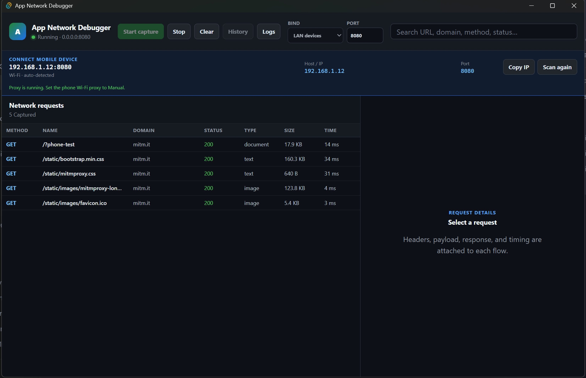

# App Network Debugger

Inspect HTTP, HTTPS, and WebSocket traffic from a mobile device in a desktop
interface inspired by the Network panel in browser developer tools.

  

## Benefits

  

- Capture HTTP, HTTPS, and WebSocket requests from mobile applications.
- Inspect URLs, methods, status codes, headers, queries, payloads, responses,
  and timing.
- Automatically detect the computer's local IP for easy mobile proxy setup.
- Save capture history and reopen previous sessions.
- Redact sensitive headers and data fields before displaying them.
- Keep captured data locally on the computer.
- Open a persistent diagnostic log when capture or networking fails.
- Pause recording while keeping proxy forwarding online, so the phone retains
  Internet access.
- Reuse a private per-installation CA and warn only when its fingerprint
  changes.
- Recognize supported Firebase and Google Analytics uploads and present their
  events, parameters, user properties, items, and consent in a dedicated view.
- Export selected or all captured network requests into standard HAR 1.2
  archives (.har) compatible with Chrome DevTools, Postman, and Charles.
- Use the packaged Windows application without installing Python or mitmproxy.

## Onboarding

  

1. Connect the phone and computer to the same Wi-Fi network.
2. Open App Network Debugger, select **LAN devices**, and click
   **Start capture**.
3. On the phone, open the current Wi-Fi settings and set **Proxy** to
   **Manual**. Enter the **Host / IP** displayed by the desktop app and port
   `8080`. Leave authentication off.
4. Click **Certificate** and scan the QR code, or open `http://mitm.it` on the
   phone, then install the mitmproxy certificate.
   On iPhone or iPad, also open **Settings → General → About → Certificate
   Trust Settings** and enable full trust for the certificate.
5. Open the mobile app you want to inspect. Select any captured request in the
   desktop app to view its headers, payload, response, and timing.

The certificate is a one-time setup for this desktop installation. Stop/Start,
closing the app, or changing Wi-Fi does not require reinstalling it unless the
desktop app explicitly reports **Certificate changed**.

Use **Pause capture** when you want to stop recording but keep the phone online.
Use **Stop** only when you want to shut down the proxy; then set the phone's
Wi-Fi proxy back to **Off**. After changing Wi-Fi networks, refresh the local IP
and update only the proxy server on the phone.

> Some applications ignore the system proxy or use certificate pinning and
> therefore cannot be captured. This project does not bypass certificate
> pinning. Only inspect devices and traffic that you own or are explicitly
> authorized to test.

## Installer

### Windows x64

- **[Download the v0.1.5 installer (.exe)](https://github.com/hdz1210/Debug-Mobile/releases/download/v0.1.5/App-Network-Debugger_0.1.5_windows-x64-setup.exe)**
- [Download the MSI package](https://github.com/hdz1210/Debug-Mobile/releases/download/v0.1.5/App-Network-Debugger_0.1.5_windows-x64.msi)
- [Verify SHA-256 checksums](https://github.com/hdz1210/Debug-Mobile/releases/download/v0.1.5/SHA256SUMS.txt)
- [View the release page](https://github.com/hdz1210/Debug-Mobile/releases/tag/v0.1.5)

The installer is not currently code-signed, so Windows SmartScreen may display
an **Unknown publisher** warning.
